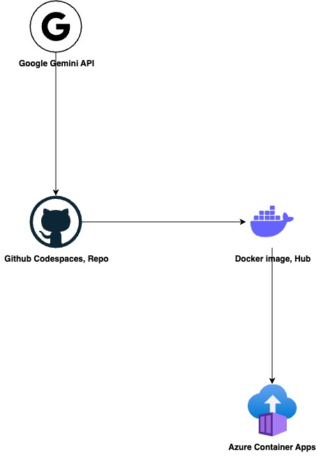

# Project Report AI Assistant

## Description

This project is a web-based application designed to generate reports/dashboards and also help users better understand, interpret, and gain insights from their data using a large language model.. This project demonstrates proficiency in modern web application development, cloud deployment, and the integration of AI services.

## App Demo

The live application can be accessed at:
https://project-report-assistant01.nicerock-1d836c24.australiaeast.azurecontainerapps.io/

## Architecture

The application is built on a robust, cloud-native architecture. The core application logic resides in a Streamlit app. This app is containerized using Docker and deployed to a Docker Hub repository. From there, it is seamlessly deployed to Azure Container Apps, which handles the scaling and management of the containerized application. The Streamlit app communicates with the Google Gemini API to perform the AI-powered text generation and summarization tasks.



## Technology Stack

- **Web Framework**: Streamlit for creating the interactive web application.
- **Data Processing**: Pandas for efficient data manipulation and analysis of JSON files.
- **AI Integration**: LangChain as a framework for building LLM applications and orchestrating calls to the LLM.
- **Large Language Model**: Google Gemini provides the core intelligence for content generation and summarization.
- **Containerization**: Docker for packaging the application and its dependencies into a portable container.
- **Container Registry**: Docker Hub for storing and managing the Docker image.
- **Cloud Hosting**: Azure Container Apps for deploying and scaling the containerized application in a serverless environment.

## Getting Started

To run this application locally or deploy it to your own environment, follow these steps.

### 1. Clone the repository

```bash
git clone https://github.com/wenhuaiqing/McNab.git
cd McNab
```

### 2. Install Dependencies

You can install the required libraries using pip:

```bash
pip install -r requirements.txt
```

### 3. Set Up Your Environment

The application requires a Google API key to access the Gemini API. If you don't have one, you can get one for free at [Google AI Studio](https://aistudio.google.com/app/apikey). Create a `.env` file in the root directory of the project and add your key. **Be sure to add `.env` to your `.gitignore` file to prevent your key from being committed to the repository.**

```
GOOGLE_API_KEY="your_api_key_here"
```

### 4. Run the Application Locally

```bash
streamlit run app.py
```

This will start the web server, and you can access the application in your browser at `http://localhost:8501`.

## Container Build and Deployment

For deployment to a cloud environment like Azure Container Apps, you will first need to containerize the application and push the image to a container registry like Docker Hub.

### 1. Log in to Docker Hub

```bash
docker login
```

### 2. Build the Docker Image

Replace `yourdockerhubusername` with your actual Docker Hub username.

```bash
docker build -t yourdockerhubusername/mcnab-app:latest .
```

### 3. Push the Image to Docker Hub

```bash
docker push yourdockerhubusername/mcnab-app:latest
```

### 4. Deploy to Azure Container Apps

In Azure Container Apps, you will need to create a new container app and point it to the Docker Hub image. Remember to configure the environment variable for your API key.

### Environment Variables in Azure Container Apps

| Name | Value |
|------|-------|
| `GOOGLE_API_KEY` | `your_key_here` |
